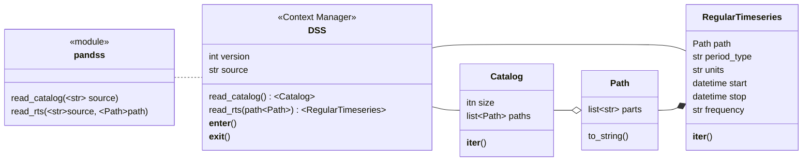

# DSS interactions like Pandas
Interact with data in DSS files like you're used to. A `pandas` like API for reading and writing data to DSS files. 

Supports:
- DSS version 6
- Reading catalogs
- Reading regular timeseries
- Writing regular timeseries

In development:
- DSS version 7
- Irregular timeseries

## Conceptual Structure

